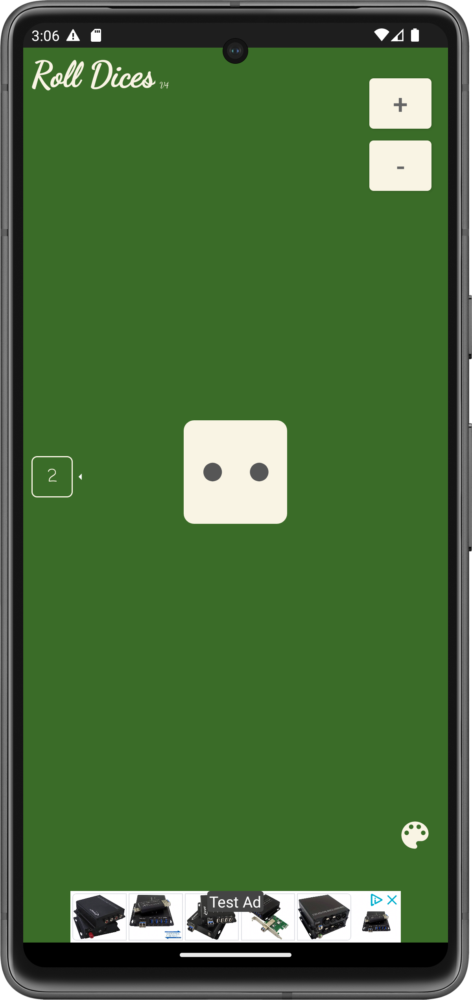
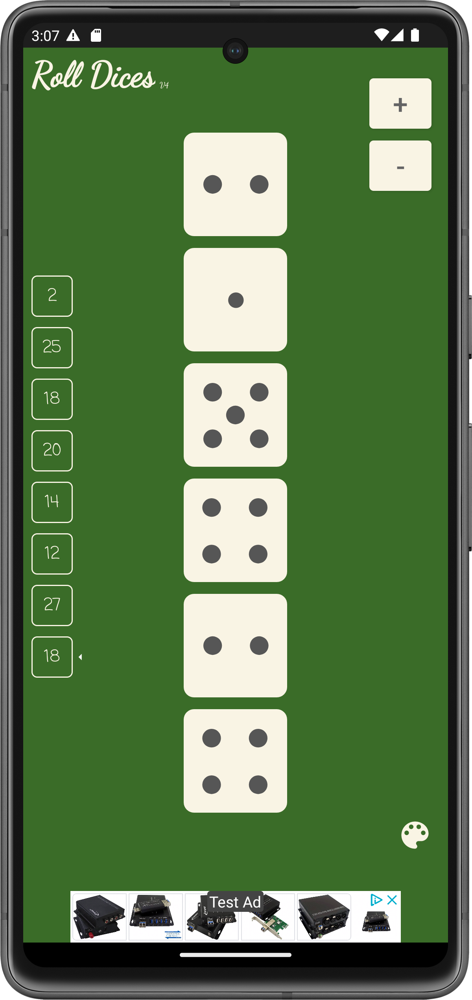

Roll Dices
=====

Simple Android App that can be used in case you have lost your dices.  
With MVVM architecture & clean code.
The size of the screen determines the number of dice to be rolled.  
Firebase used for version control.

### Tech stack

| |  |
|-------------------------|--------------------------|